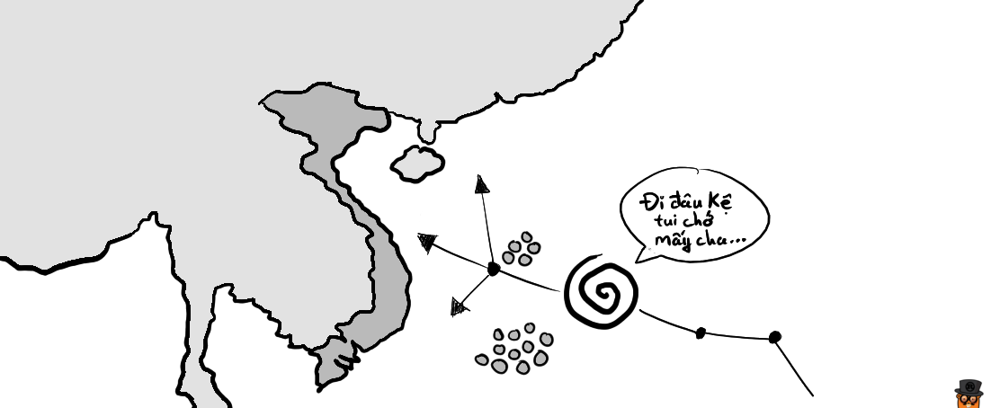
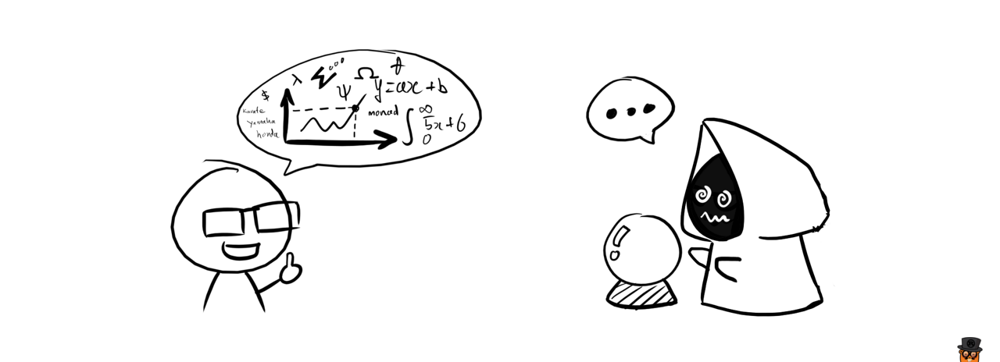
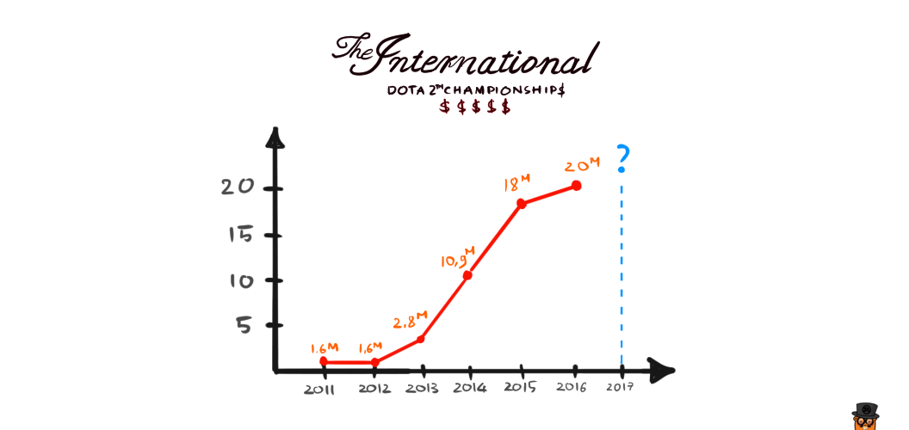

# Mô hình toán học và DotA 2

Có thể bạn đã được nghe rất nhiều về cái chữ **"mô hình"** này.

Ở công ty của mình, có 1 team Data Scientist, và đám này suốt ngày ngồi nói về **model** này, **model** nọ.

Hồi đầu tháng 6 vừa rồi, Apple cũng cho ra mắt bộ thư viện tên là **CoreML**, mà khi đọc vào bạn cũng sẽ thấy là nó cho phép chúng ta import một cái **model** gì gì đó vào bên trong ứng dụng di động để nó dự đoán kết quả cho một vấn đề nào đó. 
Hay khi xem/đọc các thông tin trên báo đài, chúng ta thường thấy đề cập đến các khái niệm như **"mô hình dự đoán"** gì gì đó.

Hoặc hằng năm cứ vào độ tháng 11, 12 thì tivi lại đưa tin bão lũ, và dự đoán đường đi của các cơn bão, làm thế nào mà các nhà khí tượng thủy văn có thể dự đoán được đường đi của bão?

Vậy những thứ **mô hình** này là gì? Chúng được tạo ra như thế nào? Và được sử dụng ra làm sao?

**Mô hình toán học** (mathematical model) là cách để biểu diễn một vấn đề nào đó trong thực tế dưới dạng toán học (thường là dạng một phương trình, hệ phương trình hay rất nhiều hệ phương trình).

Và người ta sử dụng những mô hình này để đưa ra dự đoán cho những gì sẽ xảy ra trong thực tế. Nếu dự đoán đúng, thì mô hình này chính xác, còn nếu dự đoán sai, thì mô hình này thiếu chính xác và cần phải được tính toán lại, hoặc bỏ đi hoàn toàn.

**Bình loạn:** Đây cũng là điểm khác biệt mấu chốt giữa thầy bói và nhà khoa học. Khi một nhà khoa học đưa ra một dự đoán, anh ta dựa vào những bằng chứng khoa học cụ thể đã được chứng minh kĩ (mô hình toán), còn mấy tên thầy bói dựa vào cái gì để dự đoán thì chả ai biết luôn.

---

Để hiểu rõ hơn, chúng ta cùng xem qua một ví dụ sau: 

Chúng ta muốn dự đoán prize pool của giải đấu [**The International 2017**](http://www.dota2.com/international/battlepass), với dữ liệu là prize pool của các năm trước. Lưu ý: **1M** tương đương với **1 triệu USD**.

| No. | Year | Prize Pool | Unit |
|:---:|:----:|:----------:|:----:|
|1| 2011 | 1.6M | USD |
|2| 2012 | 1.6M | USD |
|3| 2013 | 2.8M | USD |
|4| 2014 | 10.9M | USD |
|5| 2015 | 18M | USD |
|6| 2016 | 20M | USD |

Giả sử, bằng các phương pháp phân tích và tính toán, chúng ta tìm được mô hình toán học của bài toán trên là dạng của một hàm [sigmoid](https://en.wikipedia.org/wiki/Sigmoid_function):

<math>
\displaystyle{f(x) = d + \frac{a - d}{1 + \Big(\displaystyle\frac{x}{c}\Big)^b}}
</math>

Với các tham số $a$, $b$, $c$, $d$ là các điều kiện ràng buộc (coefficients) có liên quan tới vấn đề mà ta cần dự đoán. Ở đây, các điều kiện đó có thể là: 

- **Độ hấp dẫn của trò chơi Dota**: Liệu  nó có còn hot nữa không? hay là daedgeam rồi?
- **Độ hấp dẫn của các content mà Valve tung ra**: Ở thời điểm viết bài thì Valve vẫn chưa unlock Treasure level III, chưa có phần mới của Siltbreaker,...
- **Chu kì khuyến mãi kích cầu của Gaben**: Vào dịp cuối tuần này thì ngài "đại đế" tung ra khuyến mãi giảm giá 70% cho battle level, kiểu vậy đó. 
- **Tỉ lệ các đội nổi tiếng lọt qua vòng gửi xe (qualifier)**: Ngoài danh sách 6 đội được mời trực tiếp vào vòng chung kết, hiện tại vẫn đang diễn ra vòng loại hết sức gay cấn, tất nhiên nếu những cái tên đình đám như Na`Vi hay Secret hay Alliance mà bị loại hết, hoặc toàn là các team "đại lục" vào thì giải đấu chắc chắn cũng sẽ bớt hot hơn.

OK, giờ quay lại với cái công thức, giả sử sau một hồi phân tích, tính toán thì tìm được giá trị của các tham số trên lần lượt như sau:

<math>
\begin{align}
a & = 1.550568  \\
b & = 8.84699   \\
c & = 4.015717  \\
d & = 20.46788
\end{align}
</math>

Suy ra mô hình của chúng ta sẽ là:

<math>
\displaystyle{f(x) = 20.46788 + \frac{1.550568 - 20.46788}{1 + \Big(\displaystyle\frac{x}{4.015717}\Big)^{8.84699}}}
</math>

Với $x$ là số lần diễn ra sự kiện.

Dựa vào mô hình trên chúng ta có thể tính được, với $x = 7$ (năm 2017), ta tính được giá trị $f(7) \approx 20.33$.

Như vậy, mô hình của chúng ta đưa ra con số dự đoán mức tiền thưởng của giải **The International 2017** sẽ là **20 triệu 330 nghìn USD**.

Tất nhiên, khi một trong các yếu tố đã nêu ở trên thay đổi, thì mô hình này sẽ không còn đúng nữa, và chúng ta sẽ phải thực hiện việc tính toán từ đầu để tìm ra mô hình chính xác hơn.

Cũng tương tự đối với những năm tiếp theo, chúng ta chưa biết được Gaben sẽ còn những "thủ đoạn" gì mới, đến lúc đó chúng ta lại phải thay đổi mô hình một lần nữa.

Còn nếu như Valve là một công ty bảo thủ và họ không đưa ra chiến dịch gì mới, và các yếu tố đưa ra vẫn giữ nguyên từ năm này sang năm nọ, thì vào những năm tiếp theo chúng ta cứ tiếp tục dùng mô hình ở trên để dễ dàng dự đoán ra prize pool của năm đó.

---

Trong thực tế, một mô hình dự đoán phụ thuộc vào rất nhiều yếu tố (coefficients), việc tìm ra mô hình chính xác đòi hỏi chúng ta phải phân tích kĩ lưỡng vấn đề, thu thập thông tin chính xác và sau quá trình tính toán thì cần phải kiểm chứng lại thật kĩ càng (không phải ào ào như cái ví dụ trên đâu :D).

Hy vọng qua ví dụ trên, các bạn đã hiểu được thế nào là mô hình toán học, và hiểu được tầm quan trọng của nó trong đời sống thực tế.

--@TAGS: math, research
